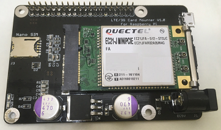
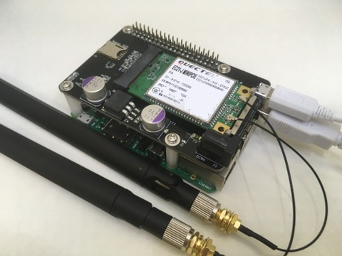

# LTE/3G Card Mounter For Raspberry Pi

## 0. 目次

1. 概要
2. 付属品 / その他部品
3. ハードウェア構築
4. ソフトウェア構築
5. サポート

## 1. 概要
* Mini PCIE規格のLTE/3GカードをRaspberry Piにマウントするシールドです。  
* 接続をUSBで行うことで高速な通信を確立します。
* 寸法： 56mm x 85mm x 29.1mm(基板上11mm/基板1.6mm/基板下16.5mm)
* 対応Raspberry Pi：B+,2,3

## 2. 付属品 / その他部品
* LTE/3G Card Mounter Shield x 1
* Shield 固定ビス x 8
* Shield 固定スペーサー x 4

### 2.1 LTE/3Gカードについて
* 本製品を動作させるには別途必要です。  
* 以下のカードについて動作確認をしております。

|デバイス|電波|必要アンテナ数|
|:-----------|:-----------|:-----------|
|EC21-J Mini PCIe|LTE|2|
|UC20-G Mini PCIe|3G|1|

### 2.2 USBケーブルについて
* 本製品を動作させるには別途必要です。  
* MicroUSBケーブルはデータ通信が可能なケーブルをお使いください。

### 2.3 アンテナについて
* 本製品を動作させるには別途必要です。  
* 技術基準適合(技適)を受けているアンテナをご購入ください。  
* 本製品は株式会社ソラコムが販売しているアンテナを推奨しております。  
 * 3G/LTE Cat.1モジュール用アンテナ HW-MULTI-GA-RSMA

### 2.4 SIMカードについて
* 本製品を動作させるには別途必要です。  
* 本製品は株式会社ソラコムが販売しているnano SIMカードを動作推奨としております。  
 * SORACOM Air SIMカード

### 2.5 ACアダプタについて
* 本製品はRaspberry Piの電源を用いて動作します。
* 別途ACアダプタを使用することでより安定的にLTE/3Gカードが動作します。
* 別途ACアダプタを調達する場合、以下の条件を満たしたACアダプタを推奨します。

|電圧|電流|極性|プラグ内径|プラグ外径|
|:-----------|:-----------|:-----------|
|5V|3A~4A|センタープラス|2.1mm|5.5mm|

* ACアダプタを接続した場合、LTE/3Gカード、Raspberry Piシステムへの電源供給も実施されます。

## 3. ハードウェア構築
* Raspberry Piと本製品をMicroUSBケーブルで接続してください。
* LTE/3Gカードを本製品と挿入してください。
* SIMカードを本製品に挿入してください。  
* アンテナをLTE/3Gカードへ接続ください。  
* 付属のスペーサー、ビスを用いてRaspberry Piと本製品を固定してください。

以下のイメージはHW-MULTI-GA-RSMA x 2, EC21-J Mini PCIeを接続した図です。

## 4. ソフトウェア構築
### 4.1 OS環境
[Raspbian](https://www.raspberrypi.org/downloads/raspbian/)の最新バージョンを利用ください。
また、ソフトウェアの構築はCUIによるコマンド操作が必要です。

### 4.1 デバイス確認
* Raspberry Piを起動し、デバイスの認識を確認します。

~~~
dmesg
~~~

以下の様なメッセージの出力を確認します。  
メッセージが出力されない場合、デバイスの接続に誤りがある可能性があります。  
2.1～2.5項目の追加デバイス/3.ハードウェア構築の内容をご確認ください。
~~~
[    8.926642] usb 1-1.5: new high-speed USB device number 4 using dwc_otg
[    9.076639] usb 1-1.5: New USB device found, idVendor=2c7c, idProduct=0121
[    9.076660] usb 1-1.5: New USB device strings: Mfr=1, Product=2, SerialNumber=0
[    9.076672] usb 1-1.5: Product: Android
[    9.076682] usb 1-1.5: Manufacturer: Quectel, Incorporated
[    9.170971] usbcore: registered new interface driver usbserial
[    9.171122] usbcore: registered new interface driver usbserial_generic
[    9.171323] usbserial: USB Serial support registered for generic
[    9.203479] usbcore: registered new interface driver option
[    9.203618] usbserial: USB Serial support registered for GSM modem (1-port)
[    9.204272] option 1-1.5:1.0: GSM modem (1-port) converter detected
[    9.210650] usb 1-1.5: GSM modem (1-port) converter now attached to ttyUSB0
[    9.211153] option 1-1.5:1.1: GSM modem (1-port) converter detected
[    9.212081] usb 1-1.5: GSM modem (1-port) converter now attached to ttyUSB1
[    9.212488] option 1-1.5:1.2: GSM modem (1-port) converter detected
[    9.213204] usb 1-1.5: GSM modem (1-port) converter now attached to ttyUSB2
[    9.213628] option 1-1.5:1.3: GSM modem (1-port) converter detected
[    9.214319] usb 1-1.5: GSM modem (1-port) converter now attached to ttyUSB3
[    9.241807] usbcore: registered new interface driver cdc_wdm
[    9.284045] qmi_wwan 1-1.5:1.4: cdc-wdm0: USB WDM device
[    9.289596] qmi_wwan 1-1.5:1.4 wwan0: register 'qmi_wwan' at usb-3f980000.usb-1.5, WWAN/QMI device,
~~~

### 4.2 必要なソフトウェアのインストール

以降の作業はrootユーザにて実施してください。
* LTE/3Gネットワークへ接続するコマンドをインストールします。

~~~
apt-get update && apt-get install wvdial
~~~

* 設定ファイルを記載します。

~~~
nano /etc/wvdial.conf
~~~

* 以下の内容を記載します。

~~~
[Dialer Defaults]
Init1 = ATZ
Init2 = ATQ0 V1 E1 S0=0 &C1 &D2 +FCLASS=0
Init3 = AT+CGDCONT=1,"IP","soracom.io"
Dial Attempts = 3
Stupid Mode = 1
Modem Type = Analog Modem
Dial Command = ATD
Stupid Mode = yes
Baud = 460800
New PPPD = yes
Modem = /dev/ttyUSB2
ISDN = 0
APN = soracom.io
Phone = *99***1#
Username = sora
Password = sora
Carrier Check = no
Auto DNS = 1
Check Def Route = 1
~~~

* 接続の確認を行います。

~~~
wvdial
~~~

* 以下の様なメッセージが出力されます。
* 接続が失敗する場合、アンテナ/SIMカード/LTE,3Gカードの緩みをご確認ください。  
また、遮蔽物の無い場所で接続をお試しください。

~~~
--> WvDial: Internet dialer version 1.61
--> Initializing modem.
--> Sending: ATZ
ATZ
OK
--> Sending: ATQ0 V1 E1 S0=0 &C1 &D2 +FCLASS=0
ATQ0 V1 E1 S0=0 &C1 &D2 +FCLASS=0
OK
--> Sending: AT+CGDCONT=1,"IP","soracom.io"
AT+CGDCONT=1,"IP","soracom.io"
OK
--> Modem initialized.
--> Sending: ATD*99***1#
--> Waiting for carrier.
ATD*99***1#
CONNECT 150000000
--> Carrier detected.  Starting PPP immediately.
--> Starting pppd at Sun Nov 12 20:57:21 2017
--> Pid of pppd: 600
--> Using interface ppp0
--> pppd: ﾀn[08]ｪ[02][02][02][02]
--> pppd: ﾀn[08]ｪ[02][02][02][02]
--> pppd: ﾀn[08]ｪ[02][02][02][02]
--> pppd: ﾀn[08]ｪ[02][02][02][02]
--> pppd: ﾀn[08]ｪ[02][02][02][02]
--> pppd: ﾀn[08]ｪ[02][02][02][02]
--> local  IP address xxx.xxx.xxx.xxx
--> pppd: ﾀn[08]ｪ[02][02][02][02]
--> remote IP address xxx.xxx.xxx.xxx
--> pppd: ﾀn[08]ｪ[02][02][02][02]
--> primary   DNS address xxx.xxx.xxx.xxx
--> pppd: ﾀn[08]ｪ[02][02][02][02]
--> secondary DNS address xxx.xxx.xxx.xxx
--> pppd: ﾀn[08]ｪ[02][02][02][02]
~~~

* IPアドレスを取得していることを確認します。

~~~
ifconfig
~~~

* 以下の例ではppp0がLTE/3Gネットワークに対するインターフェースとなります。  
インターフェースの名称は環境により異なる場合があります。

~~~
ppp0: flags=4305<UP,POINTOPOINT,RUNNING,NOARP,MULTICAST>  mtu 1500
        inet xxx.xxx.xxx.xxx  netmask xxx.xxx.xxx.xxx  destination xxx.xxx.xxx.xxx
        ppp  txqueuelen 3  (Point-to-Point Protocol)
        RX packets 5  bytes 62 (62.0 B)
        RX errors 0  dropped 0  overruns 0  frame 0
        TX packets 6  bytes 101 (101.0 B)
        TX errors 0  dropped 0 overruns 0  carrier 0  collisions 0
~~~

### 4.3 OS起動時に自動でLTE/3Gネットワークへ接続する
* この項目は必須設定ではありません。  
 OS起動時に自動的にIPアドレスを取得したい場合に設定ください。

~~~
nano /etc/systemd//system/wvdial.service
~~~

* 以下の内容を記載する。

~~~
[Unit]
Description=WWAN Connet Service
After=network.target

[Service]
Type=oneshot
RemainAfterExit=yes
KillMode=none
ExecStart=/usr/bin/wvdial

[Install]
WantedBy=multi-user.target
~~~

* 自動起動をOSへ登録します。

~~~
systemctl enable wvdial.service
~~~

## 5. サポート
本製品に関するご意見/お問い合わせはこちらの[メール](mailto:readsnow.dev@gmail.com)までお願い致します。
